Cat Classifier
==============
This is a tiny experiment to visualize the activations of each unit of a
neural network based image classifier as a graphical plot.

The image classifier in this experiment is based on a deep neural
network that has 3 hidden layers with 10 units each and a single output
layer. The hidden layers use the ReLU activation function and the output
layer uses the sigmoid activation function.

Although the model trained in this experiment works with about 80%
accuracy, that's not the primary concern of this experiment. The primary
concern of this experiment is to visualize the activations in each unit
of a trained model.

Development Setup
-----------------
The development steps here are written for a Linux or Mac system. All
steps mentioned below assume that Python 3 is installed and you are at
the top-level directory of this project.

 1. Enter the following command to create a Python 3 virtual environment
    with `numpy`, `matplotlib` and `h5py`.

        make venv

 2. Enter the following command to enter the virtual environment.

        . venv

 3. Enter the following command to train a model, test it and write the
    model to a file named `model.json`.

        ./model.py

    To alter the learning parameters, look for the `train()` function in
    this file, edit the values of `iterations` and `alpha` variables and
    run this script again.

 4. Classify arbitrary 64x64 PNG images in the [`extra-set`][T3]
    directory with the following command. You can copy any image into
    this directory as long as it is a 64x64 PNG and run the following
    command.

        ./classify.py

 5. To generate graphical plots of the learned model, enter the
    following command.

        ./plotmodel.py

    This generates activation plots for each unit in the neural network.
    This is explained further in the next section.

Activation Plots
----------------
Here are the graphical plots of the activations in each unit in each
layer. Each image is a visualization of what the activations in a
specific unit looks like. For example, the first image for layer 1 is
the visualization of the activations of the first unit in the first
hidden layer.

Each pixel in an image below represents the activation in a specific
unit for the corresponding pixel in the input image. The activation for
each component (red, green and blue) for each pixel in each unit is
computed separately. Then the activations of red, green and blue
components in each pixel is combined and shown as a single pixel in an
image below.

<!-- BEGIN AUTO -->

### Layer 1 Activations
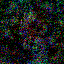
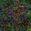
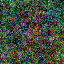
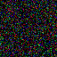
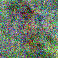
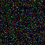
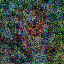
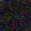
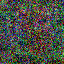
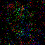

### Layer 2 Activations
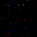
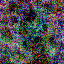
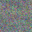
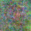
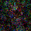

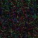
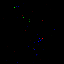
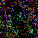
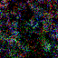

### Layer 3 Activations
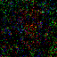
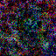
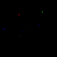
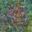
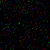
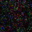
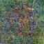
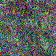
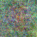
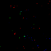

### Layer 4 Activations
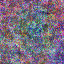

Training Images
---------------
<table>
<tr>
  <td>

 
  <td>

 
  <td>

 
  <td>

 
  <td>

 
<tr>
  <td>

 
  <td>

 
  <td>

 
  <td>

 
  <td>

 
<tr>
  <td>

 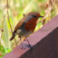
  <td>

 
  <td>

 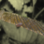
  <td>

 
  <td>

 
<tr>
  <td>

 
  <td>

 
  <td>

 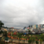
  <td>

 
  <td>

 
<tr>
  <td>

 
  <td>

 
  <td>

 
  <td>

 
  <td>

 
<tr>
  <td>

 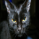
  <td>

 
  <td>

 
  <td>

 
  <td>

 
<tr>
  <td>

 
  <td>

 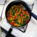
  <td>

 
  <td>

 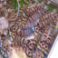
  <td>

 
<tr>
  <td>

 
  <td>

 
  <td>

 
  <td>

 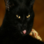
  <td>

 
<tr>
  <td>

 
  <td>

 
  <td>

 
  <td>

 
  <td>

 
<tr>
  <td>

 
  <td>

 
  <td>

 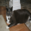
  <td>

 
  <td>

 
<tr>
  <td>

 
  <td>

 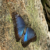
  <td>

 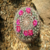
  <td>

 
  <td>

 
<tr>
  <td>

 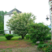
  <td>

 
  <td>

 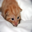
  <td>

 
  <td>

 
<tr>
  <td>

 
  <td>

 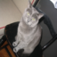
  <td>

 
  <td>

 
  <td>

 
<tr>
  <td>

 
  <td>

 
  <td>

 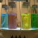
  <td>

 
  <td>

 
<tr>
  <td>

 
  <td>

 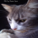
  <td>

 
  <td>

 
  <td>

 
<tr>
  <td>

 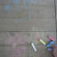
  <td>

 
  <td>

 
  <td>

 
  <td>

 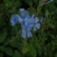
<tr>
  <td>

 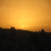
  <td>

 
  <td>

 
  <td>

 
  <td>

 
<tr>
  <td>

 
  <td>

 
  <td>

 
  <td>

 
  <td>

 
<tr>
  <td>

 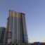
  <td>

 
  <td>

 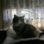
  <td>

 
  <td>

 
<tr>
  <td>

 
  <td>

 
  <td>

 
  <td>

 
  <td>

 
<tr>
  <td>

 
  <td>

 
  <td>

 
  <td>

 
  <td>

 
<tr>
  <td>

 
  <td>

 
  <td>

 
  <td>

 
  <td>

 
<tr>
  <td>

 
  <td>

 
  <td>

 
  <td>

 
  <td>

 
<tr>
  <td>

 
  <td>

 
  <td>

 
  <td>

 
  <td>

 
<tr>
  <td>

 
  <td>

 
  <td>

 
  <td>

 
  <td>

 
<tr>
  <td>

 
  <td>

 
  <td>

 
  <td>

 
  <td>

 
<tr>
  <td>

 
  <td>

 
  <td>

 
  <td>

 
  <td>

 
<tr>
  <td>

 
  <td>

 
  <td>

 
  <td>

 
  <td>

 
<tr>
  <td>

 
  <td>

 
  <td>

 
  <td>

 
  <td>

 
<tr>
  <td>

 
  <td>

 
  <td>

 
  <td>

 
  <td>

 
<tr>
  <td>

 
  <td>

 
  <td>

 
  <td>

 
  <td>

 
<tr>
  <td>

 
  <td>

 
  <td>

 
  <td>

 
  <td>

 
<tr>
  <td>

 
  <td>

 
  <td>

 
  <td>

 
  <td>

 
<tr>
  <td>

 
  <td>

 
  <td>

 
  <td>

 
  <td>

 
<tr>
  <td>

 
  <td>

 
  <td>

 
  <td>

 
  <td>

 
<tr>
  <td>

 
  <td>

 
  <td>

 
  <td>

 
  <td>

 
<tr>
  <td>

 
  <td>

 
  <td>

 
  <td>

 
  <td>

 
<tr>
  <td>

 
  <td>

 
  <td>

 
  <td>

 
  <td>

 
<tr>
  <td>

 
  <td>

 
  <td>

 
  <td>

 
  <td>

 
<tr>
  <td>

 
  <td>

 
  <td>

 
  <td>

 
  <td>

 
<tr>
  <td>

 
  <td>

 
  <td>

 
  <td>

 
  <td>

 
<tr>
  <td>

 
  <td>

 
  <td>

 
  <td>

 
</table>

Test Results
------------
<table>
<tr>
  <td>

   
  cat (pass)
  <td>

   
  cat (pass)
  <td>

   
  cat (pass)
  <td>

   
  cat (pass)
  <td>

   
  not (fail)
<tr>
  <td>

   
  not (pass)
  <td>

   
  cat (pass)
  <td>

   
  cat (pass)
  <td>

   
  cat (pass)
  <td>

   
  cat (pass)
<tr>
  <td>

   
  cat (pass)
  <td>

   
  cat (pass)
  <td>

   
  cat (pass)
  <td>

   
  not (pass)
  <td>

   
  not (pass)
<tr>
  <td>

   
  cat (pass)
  <td>

   
  not (pass)
  <td>

   
  cat (pass)
  <td>

   
  not (fail)
  <td>

   
  not (fail)
<tr>
  <td>

   
  cat (pass)
  <td>

   
  not (pass)
  <td>

   
  not (pass)
  <td>

   
  cat (pass)
  <td>

   
  cat (pass)
<tr>
  <td>

   
  cat (pass)
  <td>

   
  cat (pass)
  <td>

   
  not (pass)
  <td>

   
  not (fail)
  <td>

   
  cat (fail)
<tr>
  <td>

   
  cat (pass)
  <td>

   
  cat (pass)
  <td>

   
  cat (pass)
  <td>

   
  cat (pass)
  <td>

   
  not (pass)
<tr>
  <td>

   
  not (pass)
  <td>

   
  not (pass)
  <td>

   
  cat (pass)
  <td>

   
  cat (fail)
  <td>

   
  not (pass)
<tr>
  <td>

   
  cat (pass)
  <td>

   
  not (fail)
  <td>

   
  cat (pass)
  <td>

   
  not (pass)
  <td>

   
  cat (fail)
<tr>
  <td>

   
  not (pass)
  <td>

   
  not (fail)
  <td>

   
  cat (pass)
  <td>

   
  cat (pass)
  <td>

   
  not (pass)
</table>

Test Accuracy
-------------
Out of 50 test samples, 41 were correctly classified.

The test accuracy is: 82.00%.
<!-- END AUTO -->

Alter the learning parameters in `iterations` and `alpha` variables in
`train()` and `backward` functions, respectively, of `model.py` to alter
the test accuracy.

Training and Test Sets
----------------------
The training images and test images are present in [`train-set`][T1] and
[`test-set`][T2] directories.

The training and test data were obtained from a few HDF5 files shared by
Andrew Ng. The original H5 files are present in the [`h5data`][H1]
directory.

The script [`h5toimg.py`][H2] converts this data to separate PNG image
files and writes them to [`train-set`][T1] and [`test-set`][T2]
directories.

[T1]: ./train-set
[T2]: ./test-set
[T3]: ./extra-set
[H1]: ./h5data
[H2]: ./h5toimg.py
